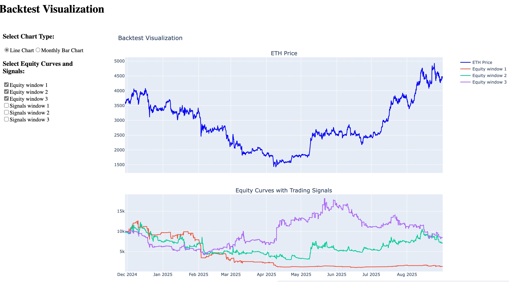

## Project Structure

```text
quant_backtest_engine/                      # Project root
├── backtest/                               # Core package (pip install -e .)
│   ├── __init__.py                         # Makes `import backtest` work
│   ├── engine.py                           # Main backtesting framework + liquidation logic
│   ├── strategy.py                         # Your full Strategy class (with add_reference_data)
│   └── analysis.py                         # All metrics (Sharpe, MDD, monthly correlation, etc.)
├── examples/                               # Ready-to-run examples
│   ├── run_backtest.py                     # Single strategy quick test
│   └── optimize_parameters.py              # Multi-parameter optimization loop
├── dashboard/                              # Interactive visualization
│   └── equity_curve_dashboard.py           # Dash app — compare all equity curves + signals
├── data/                                   # Example dataset
│   └── eth_merged_data.csv
├── requirements.txt
└── README.md


# Crypto Quant Engine – Production-Grade Event-Driven Backtesting Framework

<p align="center">
  
</p>

A fast, event-driven backtesting framework specially designed for **crypto perpetual contracts** (USDT-margined), with full leverage, liquidation and risk management simulation.

## 🚀 Core Features

- Event-driven, bar-by-bar precise simulation (liquidation checked on High/Low)  
- Full Bybit/Binance-style perpetual mechanics: leverage up to 125x, initial/maintenance margin, accurate bankruptcy price calculation  
- Realistic taker fee (0.05%) and automatic liquidation (equity floors at $10)  
- Super flexible indicator system — add any on-chain or external data in 2 lines  
- Multi-parameter optimization + one-click Dash comparison dashboard  
- Complete metrics suite: Sharpe, MaxDD, monthly correlation, P/L ratio, win rate, etc.

### Real Performance – Three Classic Strategies Head-to-Head

| Strategy                        | Total Return | Annualized | Sharpe | Max Drawdown | Trades | Win Rate |
|---------------------------------|--------------|------------|--------|--------------|--------|----------|
| Classic RSI (Long when RSI < 30) | -87%         | —          | -1.56  | -92%         | 157    | 45.9%    |
| Sentiment-driven RSI (Long when RSI > 50) | +28% | ~38%       | 0.24   | -76%         | 571    | 38.0%    |
| Classic MACD (12-26-9 crossover) | +30%         | ~41%       | 0.25   | -60%         | 243    | 40.7%    |

**Key takeaway in the 2024-2025 bull market: momentum/chasing (RSI > 50) dramatically outperforms traditional mean-reversion buying-the-dip.**

### Interactive Dashboard (instant local launch)

```bash
python equity_curve_dashboard.py

*If you're interested in detailed usage instructions, feel free to email me at dickyrider@gmail.com.
